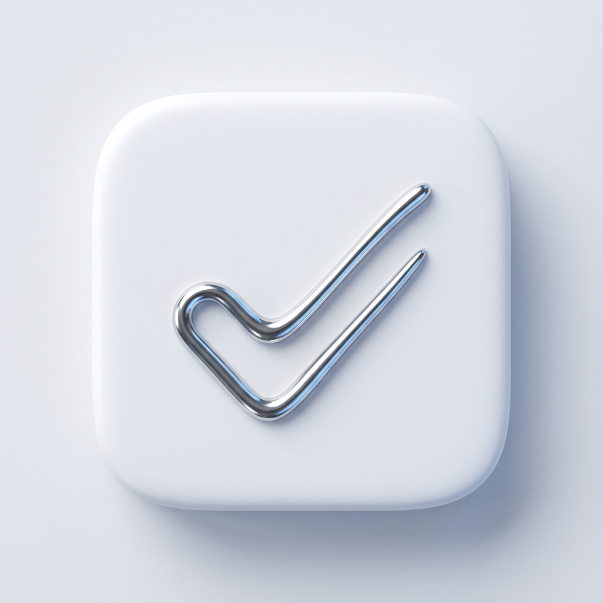

<!-- ----------------------------------------------------- -->
<!-- HEADER SECTION: LOGO & BADGES                         -->
<!-- ----------------------------------------------------- -->
<div align="center">

  <a href="https://github.com/Mahdi-mortazavi/app">
    
  </a>

  # 🍎 Nava: The Jony Ive Edition
  
  <h3>
    <b>"سادگی، حذف کردن نیست؛ رسیدن به ذات خالص است."</b>
    <br>
    <i>"Simplicity is not the absence of clutter, that's a consequence of simplicity."</i>
  </h3>

  <!-- Badges -->
  <p>
    
    
    
  </p>

  <br>

  <!-- DOWNLOAD BUTTON -->
  <a href="https://github.com/Mahdi-mortazavi/app/releases/latest">
    
  </a>

</div>

<br>

<!-- ----------------------------------------------------- -->
<!-- VIDEO DEMO                                            -->
<!-- ----------------------------------------------------- -->
<div align="center">
  
</div>

---

<!-- ----------------------------------------------------- -->
<!-- PERSIAN STORY SECTION                                 -->
<!-- ----------------------------------------------------- -->
<div dir="rtl">

## 📖 داستان ما: قیام علیه دکمه‌ها! (The Backstory)

همه چیز از یک شب طولانی شروع شد. من، **مهدی مرتضوی**، به صفحه گوشی‌ام خیره شده بودم و از دیدن اپلیکیشن‌های شلوغ، پر از دکمه و خط‌کشی‌های زمخت خسته شده بودم. با خودم گفتم: *"چرا نرم‌افزارها نمی‌توانند مثل یک قطعه کریستال، شفاف و آرامش‌بخش باشند؟"*

همان لحظه بود که روح طراحی‌های **جانی آیو (Jony Ive)** (طراح افسانه‌ای اپل) به من الهام داد:
> *"مهدی، رابط کاربری (UI) را طراحی نکن؛ آن را نامرئی کن!"*

و این‌گونه بود که **Focus** متولد شد. اپلیکیشنی که دکمه‌هایش را دور ریختیم، گوشه‌های تیزش را با فرمول‌های ریاضی سابیدیم و به پیکسل‌هایش یاد دادیم نفس بکشند.

### 🧪 سلاح مخفی: علی وارد می‌شود!
اما نوشتن کد زیبا کافی نیست. یک اپلیکیشن باید "ضد گلوله" باشد. اینجاست که **علیرضا میرزابیگی** (پسرخاله و منتقد بی‌رحم من) وارد صحنه می‌شود.

علی فقط یک تستر نیست؛ او کسی است که اگر به گوشی نگاه چپ کند، اپلیکیشن کرش می‌کند! 😂
در تمام پروژه‌های من، علی نقش آن کاربر سخت‌گیری را دارد که می‌گوید: *"مهدی، چرا وقتی با انگشت شست پای چپم روی دکمه می‌زنم و همزمان قهوه می‌خورم، ویبره گوشی ۳ میلی‌ثانیه تاخیر داره؟"*

پس اگر این اپلیکیشن مثل ساعت دقیق کار می‌کند، مدیون باگ‌گیری‌های وسواسی علی است. (اگر باگی پیدا کردید، به من نگویید، به علی بگویید که چرا از زیر دستش در رفته! 😉)

---

## ✨ ویژگی‌های جادویی (Features)

اینجا خبری از چک‌باکس‌های خسته‌کننده نیست:

1.  **مهندسی Squircle:** ما دایره‌ها را زیادی گرد و مربع‌ها را زیادی تیز می‌دانیم! تمام کارت‌ها با فرمول *Super-Ellipse* طراحی شده‌اند تا چشم‌نوازترین انحنا را داشته باشند.
2.  **تنفس دیجیتال (Breathing UI):** تایمر تمرکز ثابت نیست؛ با ریتم تنفس انسان (دم و بازدم) بزرگ و کوچک می‌شود تا ناخودآگاه استرس شما را کم کند.
3.  **لمس حبابی (Taptic Feel):** با استفاده از موتور هپتیک، تیک زدن هر تسک حسی شبیه ترکاندن حباب‌های پلاستیکی (Bubble Wrap) دارد. لذت خالص!
4.  **تمرکز لیزری:** هیچ خط و مرز اضافه‌ای وجود ندارد. فقط شما هستید و کاری که باید انجام دهید.

---

## 🚀 چگونه اجرا کنیم؟ (How to Run)

می‌خواهید جادو را روی سیستم خودتان ببینید؟

1.  **دریافت پروژه:**
    ```bash
    git clone https://github.com/Mahdi-mortazavi/app.git
    ```
2.  **نصب مخلفات (Packages):**
    ```bash
    flutter pub get
    ```
3.  **اجرا (Launch):**
    ```bash
    flutter run
    ```
    *(پیشنهاد: روی گوشی واقعی اجرا کنید تا ویبره‌ها را حس کنید!)*

</div>

---

<!-- ----------------------------------------------------- -->
<!-- ENGLISH SECTION                                       -->
<!-- ----------------------------------------------------- -->

## 🇺🇸 The English Story: Code, Coffee, and Minimalism

Welcome to **Focus**. This isn't just a productivity tool; it's a rebellion against cluttered interfaces.

I, **Mahdi Mortazavi**, inspired by the design philosophy of **Sir Jony Ive**, decided to build an app where the UI "disappears," leaving only pure focus. We removed borders, softened the edges, and added a soul to the pixels.

### 🦸‍♂️ The Secret Weapon: Ali
Behind every clean code, there's a messy testing session. Meet **Ali Reza Mirzabeigi** (my cousin and Chief "Crash" Officer). Ali has a unique talent for breaking apps in ways I didn't think were possible physics-wise. If this app feels solid, it's because it survived Ali's rigorous torture tests.

### ✨ Key Features
*   **Squircle Architecture:** Premium, organic shapes inspired by modern iOS design.
*   **Living Animations:** The UI breathes with you to induce calmness.
*   **Haptic Mastery:** Every interaction provides satisfying tactile feedback.
*   **Zero Clutter:** No unnecessary buttons. Just flow.

---

<!-- ----------------------------------------------------- -->
<!-- SCREENSHOTS GALLERY                                   -->
<!-- ----------------------------------------------------- -->
## 📸 گالری تصاویر / Screenshots

<div align="center">
  <table>
    <tr>
      <td align="center"><b>Zen Home</b><br>خانه آرام</td>
      <td align="center"><b>Deep Focus</b><br>عمیق‌ترین تمرکز</td>
      <td align="center"><b>Simple Add</b><br>افزودن سریع</td>
    </tr>
    <tr>
      <td></td>
      <td></td>
      <td></td>
    </tr>
  </table>
</div>

---

<!-- ----------------------------------------------------- -->
<!-- TEAM SECTION                                          -->
<!-- ----------------------------------------------------- -->
<br>

<div align="center">
  <h2>👨‍💻 تیم رویایی (The Dream Team)</h2>
  
  <table>
    <tr>
      <td align="center" width="200">
        <a href="https://t.me/Mahdi_mortazavi1">
          <br>
          <b>Mahdi Mortazavi</b>
        </a><br>
        <small>Creator & Lead Developer</small><br>
        <i>"Making pixels breathe"</i>
      </td>
      <td align="center" width="200">
        <a href="https://t.me/alirezamrzb">
          <!-- Placeholder avatar for Ali -->
          <br>
          <b>Ali Reza Mirzabeigi</b>
        </a><br>
        <small>Chief "Crash" Officer</small><br>
        <i>"I break things for fun"</i>
      </td>
    </tr>
  </table>

  <br>
  
  <p>
    Made with ❤️, ☕, and <b>Flutter</b>.
    <br>
    <i>Don't forget to star ⭐️ the repo if you liked the story!</i>
  </p>
</div>
